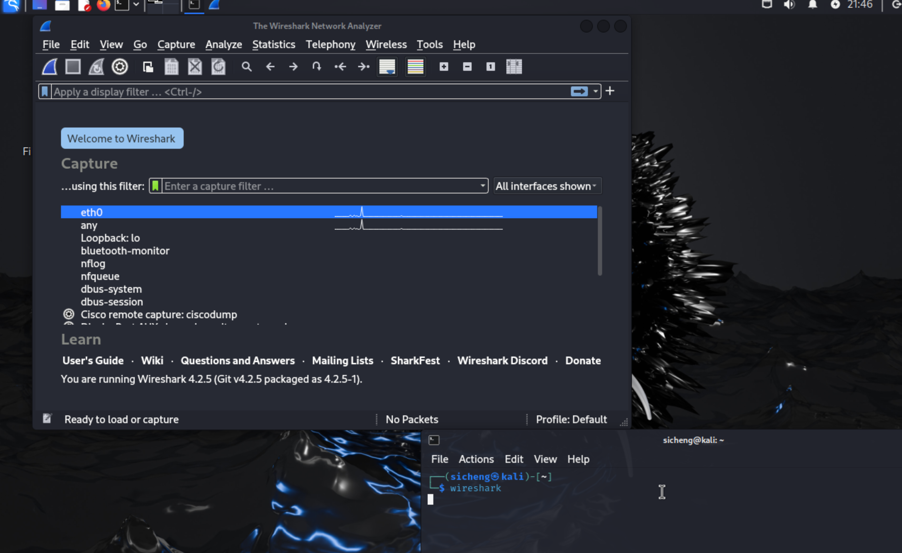
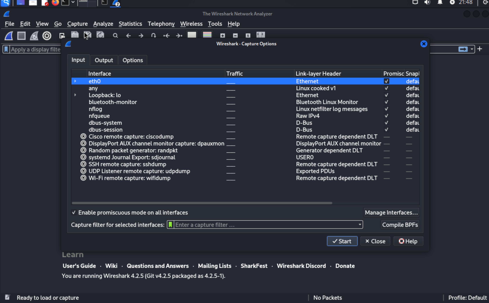
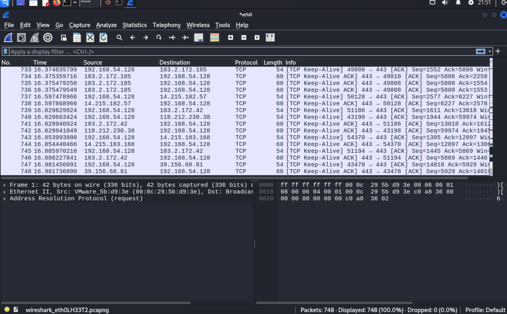
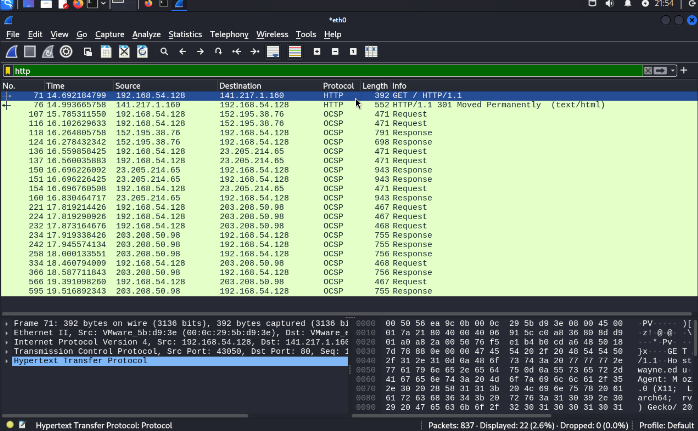
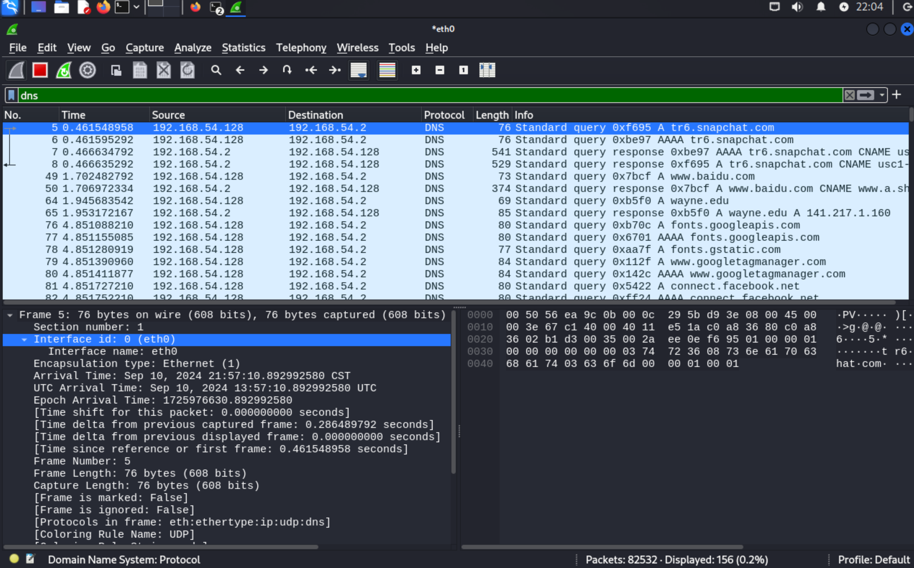
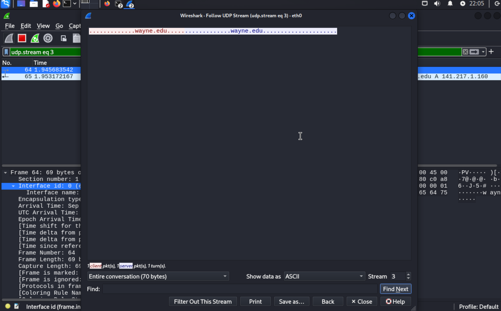
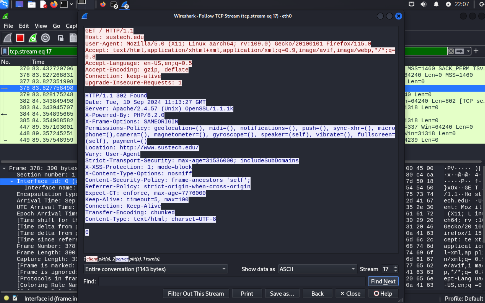
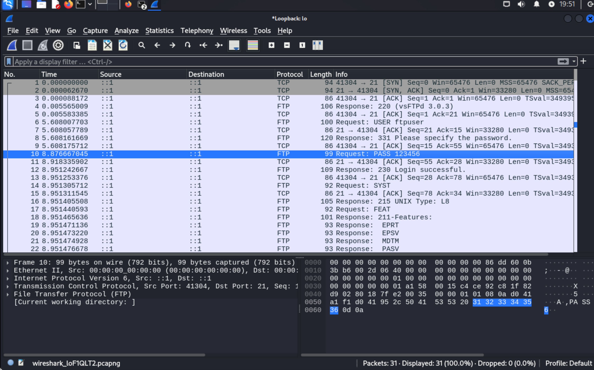

# Lab01
*12110644 周思呈*

## 01
**Carefully read the lab instructions and finish all tasks above.**

### Starting Wireshark

### Test Run

## 02
**If a packet is highlighted by black, what does it mean for the packet?**

Black identifies TCP packets with problems.

## 03
**What is the filter command for listing all outgoing http traffic?**

http.request

## 04
**Why does DNS use Follow UDP Stream while HTTP use Follow TCP Stream?**

DNS queries are usually small, simple requests that don't require the overhead of establishing and maintaining a connection, which makes UDP more efficient for this purpose.

HTTP traffic typically involves larger and more complex data transfers (such as web pages, media files, etc.), it relies on TCP to ensure that data is transmitted accurately and completely.

## 05
**Using Wireshark to capture the FTP password.**
*There is a FTP server installed on the Kali Linux VM. You need to use a terminal to log into the server and use Wireshark to capture the password. The username for the FTP server is csc5991-student, and the password is [WSU-csc5991.] without the brackets. You will user the username and password to login the FTP server while Wireshark is running. Note that the FTP server is installed on the localhost, make sure you select the right interface for the capturing. You need to explain to me how you find the password and a screenshot of the password packet. Have fun!*

I'm a Mac user so I downloaded kali image from kali official website and configured ftp service by myself. I created a user called 'ftpuser' and set the password as 123456. Then I started wireshark inside kali and captured the Loopback interface and found this password package.

