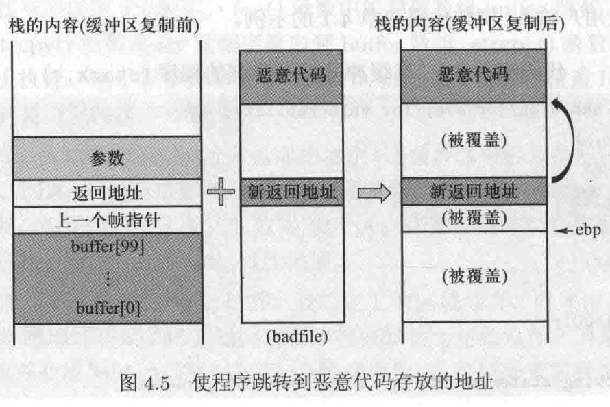
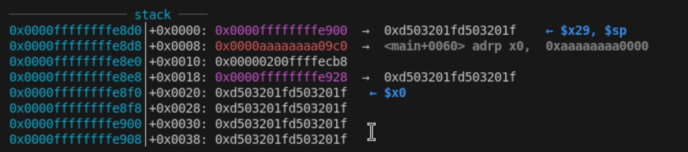

# Lab02 Work Log

## 00 Environment

`sudo echo 0 > /proc/sys/kernel/randomize_va_space` will result in `zsh: permission denied: /proc/sys/kernel/randomize_va_space`. In order to solve this, according to [How to turn off ASLR in Ubuntu 9.10](https://superuser.com/questions/127238/how-to-turn-off-aslr-in-ubuntu-9-10), we should use `sudo bash -c "echo 0 > /path/to/file"`.

## 01 Shell Code in ARM64

Reference: [Linux/ARM64 - execve("/bin/sh", NULL, NULL) Shellcode](https://www.exploit-db.com/exploits/47048)

## 02 Generate Badfile

1. Guess the memory address of injected malicious code.

ARM64 NOP:
D       5       0       3       2       0       1       F
1101	0101	0000	0011	0010	0000	0001	1111

0xD503201F

strcpy()前：
x29            0xffffffffe8d0  

(gdb) p/x *(int *)0xffffffffe8d0
$2 = 0xffffe900
(gdb) x/4x 0xffffffffe8d0
0xffffffffe8d0: 0xffffe900      0x0000ffff      0xaaaa09c0      0x0000aaaa
(gdb) info frame
Stack level 0, frame at 0xffffffffe900:
 pc = 0xaaaaaaaa0948 in bufferOverflow (BOF.c:20); saved pc = 0xaaaaaaaa09c0
 called by frame at 0xffffffffeb30
 source language c.
 Arglist at 0xffffffffe8d0, args: 
    str=0xffffffffe928 "\037 \003\325\037 \003\325\037 \003\325\037 \003\325\037 \003\325\037 \003\325\037 \003\325\037 \003\325\037 \003\325\037 \003\325\020\351\377\377\377 \003\325\037 \003\325\037 \003\325\037 \003\325\037 \003\325\037 \003\325\037 \003\325\037 \003\325\037 \003\325\037 \003\325\037 \003\325\037 \003\325\037 \003\325\037 \003\325\037 \003\325\037 \003\325\037 \003\325\037 \003\325\037 \003\325\037 \003\325\037 \003\325\037 \003\325\037 \003\325\037 \003\325\037 \003\325\037 \003\325\037 \003\325\037 \003\325\037 \003\325\037 \003\325\037 \003\325\037 \003\325\037 \003\325\037 \003\325\037 \003\325\037 \003\325\037 \003\325\037 \003\325\037 ", <incomplete sequence \325>...
 Locals at 0xffffffffe8d0, Previous frame's sp is 0xffffffffe900
 Saved registers:
  x29 at 0xffffffffe8d0, x30 at 0xffffffffe8d8

strcpy()后：
x29            0xffffffffe8d0 没变

ARM64中retrun address在低地址（e8d8），buffer（e8f0）向高地址overflow，所以无法在这种情况下实现攻击。

0xffffffffe900: 0x14131211      0x18171615      0x1c1b1a19      0x0000ff00
0xffffffffe910: 0xffffeca8      0x0000ffff      0xf7df4938      0x00000001
0xffffffffe920: 0xf7df24dc      0x0000ffff      0x04030201      0x08070605
0xffffffffe930: 0x0c0b0a09      0x100f0e0d      0x14131211      0x18171615
0xffffffffe940: 0x1c1b1a19      0x00000000      0x24232221      0x28272625
0xffffffffe950: 0x2c2b2a29      0x302f2e2d      0x34333231      0x38373635
0xffffffffe960: 0x3c3b3a39      0x403f3e3d      0x44434241      0x48474645
0xffffffffe970: 0x4c4b4a49      0x504f4e4d      0x54535251      0x58575655
0xffffffffe980: 0x5c5b5a59      0x605f5e5d      0x64636261      0x68676665
0xffffffffe990: 0x6c6b6a69      0x706f6e6d      0x74737271      0x78777675

