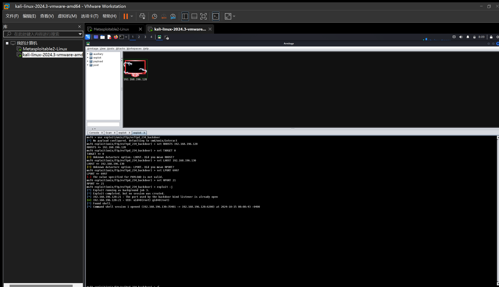

# Lab 04 Report

SID: 12110644
Name: Sicheng Zhou

## Find IP Address

## DistCC Daemon Command Execution

## Samba MS-RPC Shell Command Injection

## Armitage

## Questions

**2. Use nmap to scan the target and find the software version of the OS and the running services (list at least 3 of the running services). What are the differences if we use T1, T2, T3 flags? How to avoid detection from an intrusion detection system (e.g., stealthy scanning)?**

Service Info: Hosts:  metasploitable.localdomain, irc.Metasploitable.LAN; OSs: Unix, Linux; CPE: cpe:/o:linux:linux_kernel

Running services: ftp, ssh, telnet...

The T1, T2, and T3 flags in nmap control the timing templates for scans, which affect the speed and stealthiness of the scan. Each flag adjusts how aggressively nmap probes the target, impacting both performance and the likelihood of being detected by Intrusion Detection Systems (IDS).

A few techniques that can help minimize detection when scanning a target:

1. Use the -sS (SYN Scan): It doesn’t complete the TCP handshake. Instead, it sends a SYN packet, waits for a response, and closes the connection without completing the handshake.
2. Use Timing Templates like T1 or T2: Slower scans with these flags reduce the traffic rate, making it harder for IDS to detect suspicious patterns.
3. Fragment Packets (-f flag): This breaks up your scan packets into smaller fragments, which can sometimes bypass simple IDS systems that rely on signature-based detection.

**Why do we need to assign an internal IP address (i.e., behind NAT) for Metasploitable2-Linux? What will happen if we assign a public IP to it?**

1. Security: By placing it behind a NAT (Network Address Translation) and assigning an internal IP, it adds a layer of protection. The system is not directly exposed to the internet, and access is controlled through the router/firewall.
2. Network Segmentation: NAT helps create a segmented network where we can safely run and isolate vulnerable machines like Metasploitable2 from our main network and the internet. This prevents malicious activities from spreading or compromising other systems.

If you assign a public IP to Metasploitable2, several issues may arise:

1. Immediate Attacks: Since Metasploitable2 is highly vulnerable, attackers scanning the internet for exposed systems could find and exploit it very quickly. This could lead to unauthorized access, data theft, or use of the system in botnets.
2. Compromise of Other Systems: If attackers gain control of Metasploitable2, they could launch attacks on other systems within the network, compromising your entire environment.

**Exploit another vulnerability using both msfconsole and Armitage.**

vsftpd_234_backdoor

