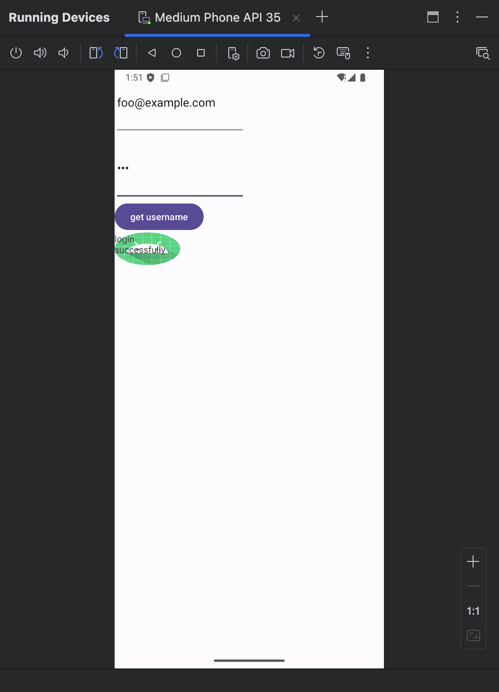
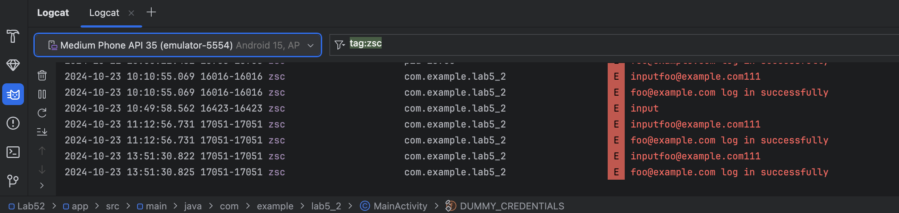

# Lab 05
SID: 12110644 
Name: Sicheng Zhou

## 1 Repackage an Android Application

I complete this assignment on my laptop without virtual machine. 
I wrote a login application which will take in a username and a password and verify whether it matches in the `DUMMY_CREDENTIALS` array.
If so, a window will pop up, displaying "login successfully".

Then I followed the lab tutorial to repackage the application. 
The commands I use is a bit different with those provided in the tutorial due to OS and software version difference.

1. My `MainActivity` class is in file classes3.dex.

2. If compress resources.arsc file, there will be an error `Targeting R+ (version 30 and above) requires the resources.arsc of installed APKs to be stored uncompressed and aligned on a 4-byte boundary`. So I zipped all the files except resources.arsc.

3. If use jarsigner to sign the apk file, there will be and error `Installation error: INSTALL_PARSE_FAILED_NO_CERTIFICATES`. So I used apksigner to sign the file.

All the commands used are recorded in cmd.txt.

Then I modified the MainActivity.smali file to let it write down the username and password to the log.
Below is the screenshot of logcat.

## 2 Obfuscate

**a. What tools did you use?**

ProGuard and R8 (default tools in Android).

**b. Can you still repackage the application using baksmali or smali tool? Justify your answer.**

Yes, it is still possible to repackage an obfuscated application using Baksmali or Smali, but there are certain limitations and challenges.

Even if the application is obfuscated, Baksmali can still disassemble the classes.dex file into Smali code. This is because obfuscation only alters the human-readable names (such as class names, method names, and variable names) but doesn’t change the bytecode format itself.
The disassembled code will still be functional, but due to obfuscation, the meaningful names of classes and methods will be replaced with meaningless names (like a, b, c, etc.), making the code difficult to understand.

