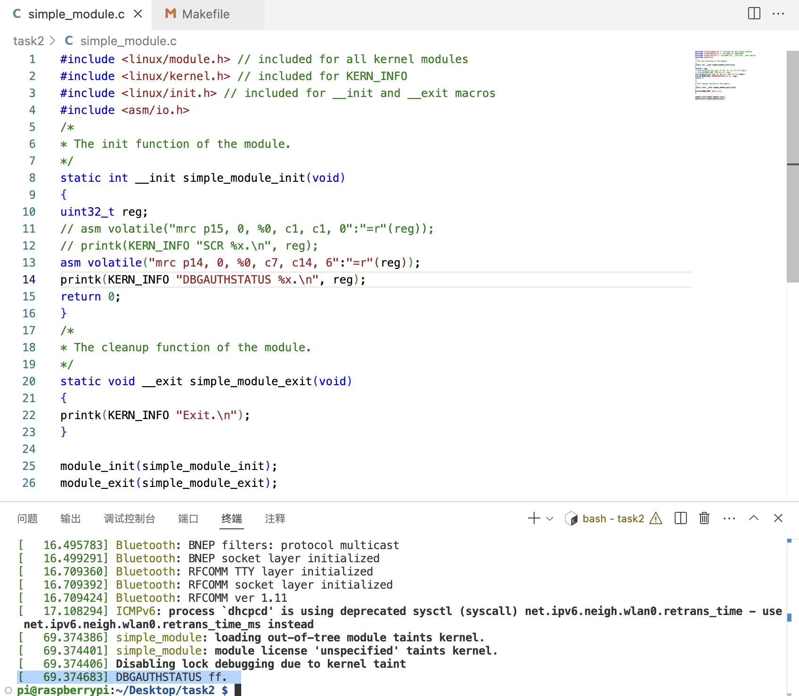

# Lab 07

Name: Sicheng Zhou

SID: 12110644

## Task 1: Create and Install a Kernel Module

After running `sudo insmod simple_module.ko`, `dmesg` will display four more following lines.

```
[ 1443.616329] simple_module: loading out-of-tree module taints kernel.
[ 1443.616347] simple_module: module license 'unspecified' taints kernel.
[ 1443.616354] Disabling lock debugging due to kernel taint
[ 1443.616698] Hello world.
```

After running `sudo rmmod simple_module`, `dmesg` will display "exit" after "hello world".

**Question: What is the exception level and the security state of the core with loaded LKM?**

When a Loadable Kernel Module (LKM) like the one shown is loaded, it runs within the kernel space of the operating system, typically at Exception Level 1 (EL1) with a non-secure state.

## Task 2: Directly Access a High Privilege Register: SCR

**Task 2.a: What is the complete instruction?**

`asm volatile("mrc p15, 0, %0, c1, c1, 0":"=r"(reg));`

**Task 2.b: Question: Why the segmentation fault occurs?**

Error message in dmesg:

```
[  507.480130] Internal error: Oops - undefined instruction: 0 [#1] SMP ARM
```

Unprivileged Access to System Control Registers: SCR is privileged and typically accessible only at a high exception level, such as EL3 (for secure mode) or EL1 (kernel mode) on ARMv8. In a standard Linux kernel environment, attempting to read or write such a privileged register from module code (especially outside secure mode) will cause an undefined instruction exception, leading to a segmentation fault.

## Task 3: Read the Debug Authentication Signal

**Task 3.a: Question: What is the instruction to read DBGAUTHSTATUS? Suppose we want to store it in Rt.**

`MRC p14,0,<Rt>,c7,c14,6 ; Read DBGAUTHSTATUS into Rt`

**Task 3.b: Take single_module.c as an example, write your kernel module to read the signal. A screenshot of the result is needed, and tell us what is the meaning of the result. What kind of debug events are enabled?**



Bits [31:8] reserved.

SNID, bits [7:6], Secure non-invasive debug. 11 means implemented and enabled.

SID, bits [5:4], Secure invasive debug. 11 means implemented and enabled.

NSNID, bits [3:2], Non-secure non-invasive debug. 11 means implemented and enabled.

NSID, bits [1:0], Non-secure invasive debug. 11 means implemented and enabled.

## Task 4: Enable the Halting Debug

```c
#define EDLAR_OFFSET 0xFB0
#define OSLAR_OFFSET 0x300

...

iowrite32(0xc5acce55, param->debug_register + EDLAR_OFFSET);
iowrite32(0xc5acce55, param->cti_register + EDLAR_OFFSET);
iowrite32(0x0, param->debug_register + OSLAR_OFFSET);
iowrite32(0x0, param->cti_register + OSLAR_OFFSET);
```

## Task 5: Switch to the EL3 and read the SCR

The code to access SCR is `mrc p15, 0, R0, c1, c1, 0`. The corresponding machine code is `0xee111f11`.

To transfer the value of R1 on core 0 to the local variable scr, first load the value from R0 to p14, then read from `param->debug_register + DBGDTRTX_OFFSET`.

```c
    // Step 7: Read the SCR
    printk(KERN_INFO "Step 7: Read SCR\n");
    // 0xee111f11 <=> mrc p15, 0, R0, c1, c1, 0
    execute_ins_via_itr(param->debug_register, 0x1f11ee11);
    // 0xee001e15 <=> mcr p14, 0, R0, c0, c5, 0
    execute_ins_via_itr(param->debug_register, 0x1e15ee00);
    scr = ioread32(param->debug_register + DBGDTRTX_OFFSET);
```

## Task 6: Restore the Context and Exit


The value of SCR is `0x00000131`.

TWE, bit [13]: Traps WFE instructions to Monitor mode.
0: This control has no effect on the execution of WFE instructions.

TWI, bit [12]: Traps WFI instructions to Monitor mode.
0: This control has no effect on the execution of WFI instructions.

SIF, bit [9]: Secure instruction fetch. 
0: Secure state instruction fetches from Non-secure memory are permitted.

HCE, bit [8]: Hypervisor Call instruction enable.
1: HVC instructions are enabled at EL2 and Non-secure EL1.

SCD, bit [7]: Secure Monitor Call disable. 
0: SMC instructions are enabled.

nET, bit [6]: Not Early Termination.
0: Early termination permitted. Execution time of data operations can depend on the data values.

AW, bit [5]: When the value of SCR.EA is 1 and the value of HCR.AMO is 0, this bit controls whether CPSR.A masks an external abort taken from Non-secure state.
1: External aborts taken from either Security state are masked by CPSR.A. When CPSR.A is 0, the abort is taken to EL3.

FW, bit [4]: When the value of SCR.FIQ is 1 and the value of HCR.FMO is 0, this bit controls whether CPSR.F masks an FIQ interrupt taken from Non-secure state.
1: An FIQ taken from either Security state is masked by CPSR.F. When CPSR.F is 0, the FIQ is taken to EL3.

EA, bit [3]: External Abort handler. This bit controls which mode takes external aborts. 
0: External aborts taken to Abort mode.

FIQ, bit [2]: FIQ handler.
0: FIQs taken to FIQ mode.

IRQ, bit [1]: IRQ handler. This bit controls which mode takes IRQ exceptions.
0: IRQs taken to IRQ mode.

NS, bit [0]: Non-secure bit. Except when the PE is in Monitor mode, this bit determines the Security state of the PE.
1: PE is in Non-secure state.

## Questions

**1. During this lab, what is the base address of Cross Trigger Interface in Raspberry Pi 3? Can your find the global address of CTICONTROL register in Raspberry Pi 3 according to the Arm Reference Manual? Answer the address value and show your calculation. (hint: Find the offset)**

`0x40038000` is the base address of the cross trigger interface registers on Core 0.

CTICONTROL offset is `0x000`, so the global address of it is `0x40038000`.

**2. Do we have another way to unlock the OS Lock in this lab except memory mapping? If yes, how to do that? Justify your answer.**

Yes, we can use hardware-debugging tools such as JTAG + debug authentication to do this.
Using a hardware debugger allows direct access to the system’s memory and registers without needing the OS to be actively involved or for the memory to be mapped in software. 

