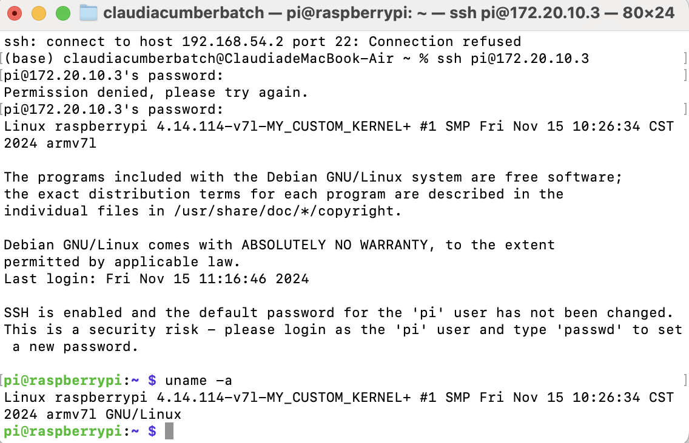
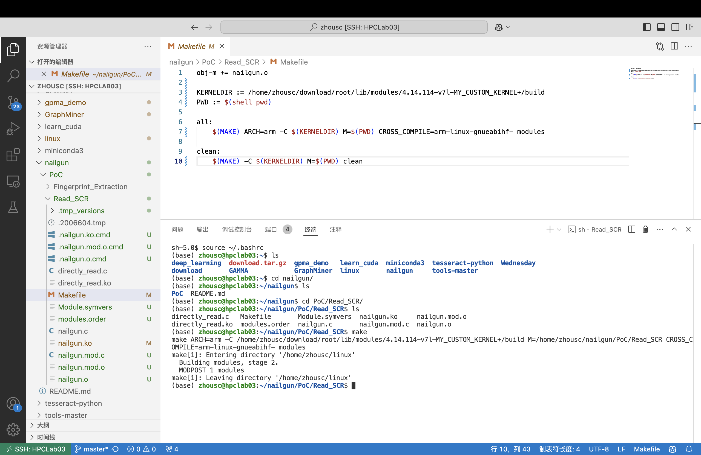
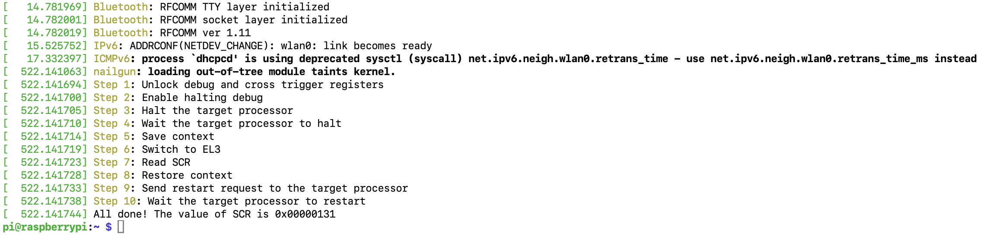

# Lab 08 Nailgun Defense

SID: 12110644

Name: Sicheng Zhou

**Question 1:(20%) Can you prove that (1) you have replaced the kernel (with ”uname -r” or other approaches), and (2) you have built the nailgun module with new headers? Please provide a figure.**

**Question 2:(20%) Can you run the Nailgun Attack on your new kernel? Please provide a figure. You can use ”dmesg” to show the execution result of Nailgun Attack.**

**Question 3**

0. Page table assumption. The provided source code shows that the base address of level 1 page table is `0x3200 0000`. We assume that the base address of level 2 page table is `0x3201 0000` (`0x4` - `0x8`) and `0x3203 0000` (`0x0` - `0x4`), level 3 is `0x3202 0000`.

VTCR = `0x8000 0040` so SL0 = `0b01` which means the translation table walk starts at level 1, T0SZ = `0b0000` so n = 5.

My SID is 12110644 so IPA = `0x4003 0644`.

1. Initial lookup. According to figure G4-16, descriptor address = `0x3200 0000` + (`0b01` << 3) = `0x3200 0008`. 

2. Level 1 lookup. Assume the value in `0x3200 0008` is `0x3201 xxx3`. The next descriptor address = (`0x3201 xxx3` >> 12 << 12) | (`0b0000 0000 0000`) = `0x3201 x000`. 

3. Level 2 lookup. Assume the value in `0x3201 x000` is `0x3202 xxx3`. The next descriptor address = (`0x3202 xxx3` >> 12 << 12) | (`0b0001 1000 0000`) = `0x3202 x180`.

4. Level 3 lookup. In protection, the last bit of this lookup should be set to 0 to indicate that this is invalid. But for now, we want to output the PA with the same value of IPA. We let the last two bits to be `0b01` so the translation finished here, and bits[39:12] should be `0x40030`. So we store `0x4003 0001` here.

Note that all the `x` value in the calculation process can simply be 0.

**Question 4**

IPA = `0x4211 0644` = `0b 0100 0010 0001 0001 0000 0110 0100 0100`.

1. Initial lookup. The same as Question 3, descriptor address = `0x3200 0008`.

2. Level 1 lookup. The value in `0x3200 0008` is `0x3201 xxx3`. The next descriptor address = (`0x3201 xxx3` >> 12 << 12) | (`0b0000 1000 0000`) = `0x3201 x080`.

3. Level 2 lookup. Assume the value in `0x3201 x080` is `0x3202 xxx3`. The next descriptor address = (`0x3202 xxx3` >> 12 << 12) | (`0b1000 1000 0000`) = `0x3202 x880`.

4. Level 3 lookup. We let the last two bits to be `0b01` so the translation finished here, and bits[39:12] should be `0x42110`. So we store `0x4211 0001` here.