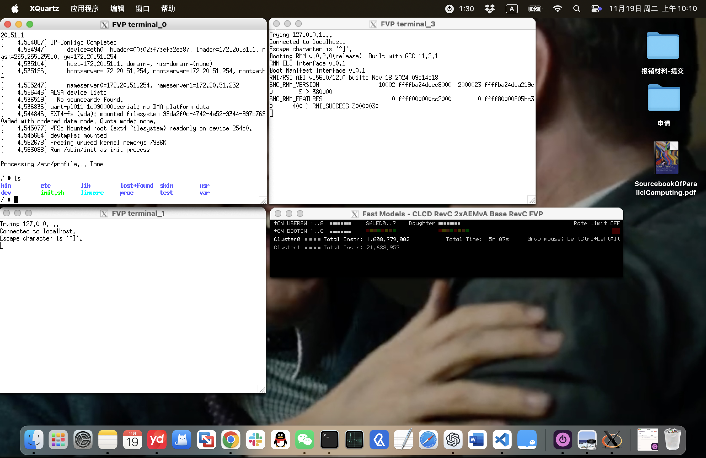
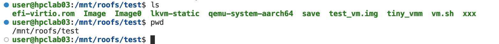
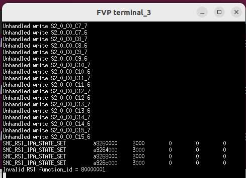
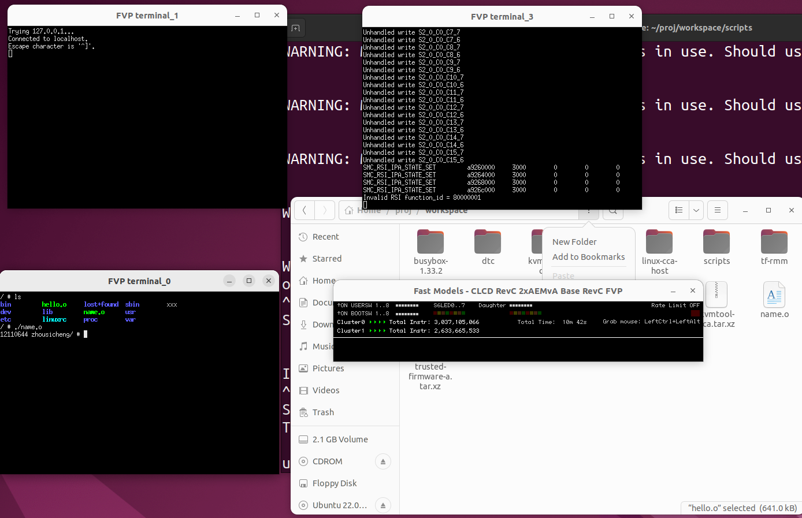

# Lab 09 TEE

Name: Sicheng Zhou

SID: 12110644

## Task 1 Launch FVP

**Task 1.a: Please provide screenshots demonstrating that you have successfully booted the Linux Kernel on FVP. (20%)**



**Task 1.b: What are the exception level and the security state of RMM? (10%)**

EL2, realm security state.

**Task 1.c: Review the source code of ’linux-cca’, identify at least two instances where RMIs are dispatched to RMM, and explain the functionality of these RMIs. (20%) (The definitions of RMIs can be found in the source code of 'kvm_realm_rmi.h'.)**

1. linux-cca/arch/arm64/kvm/rme.c, `rmi_check_version(void)`.

This function ensures that the RMM supports the required RMI ABI version for the KVM subsystem to function correctly. The code dispatches an RMI command (`SMC_RMI_VERSION`) to the RMM through the SMC mechanism

```c
static int rmi_check_version(void)
{
	struct arm_smccc_res res;
	int version_major, version_minor;

	arm_smccc_1_1_invoke(SMC_RMI_VERSION, &res);

	if (res.a0 == SMCCC_RET_NOT_SUPPORTED)
		return -ENXIO;

	version_major = RMI_ABI_VERSION_GET_MAJOR(res.a0);
	version_minor = RMI_ABI_VERSION_GET_MINOR(res.a0);

#ifdef PROTOTYPE_RMI_ABI_MAJOR_VERSION
	// Support the prototype
	if (version_major == PROTOTYPE_RMI_ABI_MAJOR_VERSION) {
		kvm_err("Using prototype RMM support (version %d.%d)\n",
			version_major, version_minor);
		return 0;
	}
#endif
	if (version_major != RMI_ABI_MAJOR_VERSION) {
		kvm_err("Unsupported RMI ABI (version %d.%d) we support %d\n",
			version_major, version_minor,
			RMI_ABI_MAJOR_VERSION);
		return -ENXIO;
	}

	kvm_info("RMI ABI version %d.%d\n", version_major, version_minor);

	return 0;
}
```

2. linux-cca/arch/arm64/kvm/rme.c, `realm_create_protected_data_page()`.

The function creates a secure data page within the Realm by interacting with the RMM. It handles granule delegation, data creation, and error recovery comprehensively. The function dispatches multiple RMIs (`rmi_granule_delegate`, `rmi_data_create`, `rmi_granule_undelegate`) to the RMM.

```c
static int realm_create_protected_data_page(struct realm *realm,
					    unsigned long ipa,
					    struct page *dst_page,
					    struct page *tmp_page)
{
	phys_addr_t dst_phys, tmp_phys;
	int ret;

	copy_page(page_address(tmp_page), page_address(dst_page));

	dst_phys = page_to_phys(dst_page);
	tmp_phys = page_to_phys(tmp_page);

	if (rmi_granule_delegate(dst_phys))
		return -ENXIO;

	ret = rmi_data_create(dst_phys, virt_to_phys(realm->rd), ipa, tmp_phys,
			      RMI_MEASURE_CONTENT);

	if (RMI_RETURN_STATUS(ret) == RMI_ERROR_RTT) {
		/* Create missing RTTs and retry */
		int level = RMI_RETURN_INDEX(ret);

		ret = realm_create_rtt_levels(realm, ipa, level,
					      RME_RTT_MAX_LEVEL, NULL);
		if (ret)
			goto err;

		ret = rmi_data_create(dst_phys, virt_to_phys(realm->rd), ipa,
				      tmp_phys, RMI_MEASURE_CONTENT);
	}

	if (ret)
		goto err;

	return 0;

err:
	if (WARN_ON(rmi_granule_undelegate(dst_phys))) {
		/* Page can't be returned to NS world so is lost */
		get_page(dst_page);
	}
	return -ENXIO;
}
```

## Task 2 Launch Realm VM

**Task 2.a: Provide screenshots to show that you have already compiled kvmtool and copy it to FVP. (20%)**



**Task 2.b: Provide screenshots to show that you have already launched a Realm VM. (10%)**



**Task 2.c: Write a simpe application to print your Student ID and name, and execute it in the Realm VM. (10%)**



**Task 2.d: What is the exception level and the security state of kvmtool? (10%)**

EL0, non-secure state.