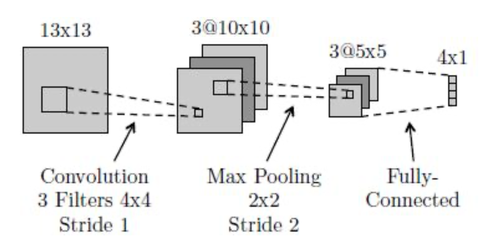

# Homework V

12110644 周思呈

## Question 1

**Consider a regression problem involving multiple target variables in which it is assumed that the distribution of the targets, conditioned on the input vector x, is a Gaussian of the form**
$$
p(\mathbf{t|x,w}) = \mathcal N(\mathbf{t|y(x,w), \Sigma)}
$$

**where $\mathbf{y(x,w)}$ is the output of a neural network with input vector $\mathbf x$ and wight vector $\mathbf w$, and $\mathbf \Sigma$ is the covariance of the assumed Gaussian noise on the targets. **

**(a) Given a set of independent observations of $\mathbf x$ and $\mathbf t$, write down the error function that must be minimized in order to find the maximum likelihood solution for $\mathbf w$, if we assume that $\mathbf \Sigma$ is fixed and known. **

The likelihood is
$$
p(\mathbf{T} \mid \mathbf{X}, \mathbf{w})=\prod_{n=1}^{N} \mathscr{N}\left(\mathbf{t}_{\mathbf{n}} \mid \mathbf{y}\left(\mathbf{x}_{\mathbf{n}}, \mathbf{w}\right), \mathbf \Sigma \right)
$$
Take negative logarithm
$$
E(\mathbf{w}, \boldsymbol{\Sigma})=\frac{1}{2} \sum_{n=1}^{N}\left\{\left[\mathbf{y}\left(\mathbf{x}_{\mathbf{n}}, \mathbf{w}\right)-\mathbf{t}_{\mathbf{n}}\right]^{T} \mathbf \Sigma^{-1}\left[\mathbf{y}\left(\mathbf{x}_{\mathbf{n}}, \mathbf{w}\right)-\mathbf{t}_{\mathbf{n}}\right]\right\}+\frac{N}{2} \ln |\mathbf \Sigma|+\text { const }
$$

If  $\mathbf \Sigma$  is fixed and known

$$
E(\mathbf{w})=\frac{1}{2} \sum_{n=1}^{N}\left\{\left[\mathbf{y}\left(\mathbf{x}_{\mathbf{n}}, \mathbf{w}\right)-\mathbf{t}_{\mathbf{n}}\right]^{T} \mathbf \Sigma^{-1}\left[\mathbf{y}\left(\mathbf{x}_{\mathbf{n}}, \mathbf{w}\right)-\mathbf{t}_{\mathbf{n}}\right]\right\}+\text { const }
$$

**(b) Now assume that $\mathbf \Sigma$ is also to be determined from the data, and write down an expression for the maximum likelihood solution for $\mathbf \Sigma$. (Note: The optimizations of $\mathbf w$ and $\mathbf \Sigma$ are now coupled.)**

By rewriting $E(\mathbf{w}, \boldsymbol{\Sigma})$ we get

$$
-\frac{N}{2} \ln |\boldsymbol{\Sigma}|-\frac{1}{2} \operatorname{Tr}\left[\boldsymbol{\Sigma}^{-1} \sum_{n=1}^{N}\left(\mathbf{t}_{n}-\mathbf{y}_{n}\right)\left(\mathbf{t}_{n}-\mathbf{y}_{n}\right)^{\mathrm{T}}\right] .
$$
We can maximize this by setting the derivative w.r.t.  $\boldsymbol{\Sigma}^{-1}$  to zero, yielding

$$
\boldsymbol{\Sigma}=\frac{1}{N} \sum_{n=1}^{N}\left(\mathbf{t}_{n}-\mathbf{y}_{n}\right)\left(\mathbf{t}_{n}-\mathbf{y}_{n}\right)^{\mathrm{T}} .
$$

## Question 2

**The error function for binary classification problems was derived for a network having a logistic-sigmoid output activation function, so that $0 \leq y(\mathbf{x,w}) \leq 1$, and data having target values $t \in \{0,1\}$. Derive the corresponding error function if we consider a network having an output $-1 \leq y(\mathbf{x,w}) \leq 1$ and target values $t = 1$ for class $\mathcal C_1$ and $t = -1$ for class $\mathcal C_2$. What would be the appropriate choice of output unit activation function? **

**Hint. The error function is given by:**

$$E(\mathbf w) = -\sum^N_{n=1}\{t_n\mathrm{ln}y_n + (1-t_n)\mathrm{ln}(1 - y_n)\}.$$

Mapping the original output range to the new output range, we could set 
$$
y = 2 \sigma(a) - 1
$$

The conditional distribution of targets given inputs is

$$
p(t \mid \mathbf{x}, \mathbf{w})=\left[\frac{1+y(\mathbf{x}, \mathbf{w})}{2}\right]^{(1+t) / 2}\left[\frac{1-y(\mathbf{x}, \mathbf{w})}{2}\right]^{(1-t) / 2}
$$
Where  $\frac{[1+y(\mathbf{x}, \mathbf{w})]} {2}$  represents the conditional probability  $p\left(C_{1} \mid x\right)$. The likelihood is
$$
p(\mathbf{T} \mid \mathbf{X}, \mathbf{w})=\prod_{n=1}^{N} p(t_n \mid \mathbf{x}_n, \mathbf{w}_n)
$$
Take negative logarithm
$$
\begin{aligned}
E(\mathbf{w}) & =-\sum_{n=1}^{N}\left\{\frac{1+t_{n}}{2} \ln \frac{1+y_{n}}{2}+\frac{1-t_{n}}{2} \ln \frac{1-y_{n}}{2}\right\} \\
& =-\frac{1}{2} \sum_{n=1}^{N}\left\{\left(1+t_{n}\right) \ln \left(1+y_{n}\right)+\left(1-t_{n}\right) \ln \left(1-y_{n}\right)\right\}+N \ln 2
\end{aligned}
$$
The choice of output unit activation function can be 
$$
\text{tanh}(a/2) = \frac{e^{a/2} - e^{-a/2}}{e^{a/2} + e^{-a/2}}
$$

## Question 3

**Verify the following results for the conditional mean and variance of the mixture density network model.**

(a) $$\mathbb E[\mathbf{t|x}] = \int \mathbf tp(\mathbf{t|x})\mathrm d \mathbf t = \sum_{k=1}^{K} \pi_k(\mathbf x)\mu_k(\mathbf x).$$
$$
\begin{aligned}
\mathbb{E}[\mathbf{t} \mid \mathbf{x}] & =\int \mathbf{t} p(\mathbf{t} \mid \mathbf{x}) d \mathbf{t} \\
& =\int \mathbf{t} \sum_{k=1}^{K} \pi_{k} \mathscr{N}\left(\mathbf{t} \mid \boldsymbol{\mu}_{k}, \sigma_{k}^{2}\right) d \mathbf{t} \\
& =\sum_{k=1}^{K} \pi_{k} \int \mathbf{t} \mathscr{N}\left(\mathbf{t} \mid \boldsymbol{\mu}_{k}, \sigma_{k}^{2}\right) d \mathbf{t} \\
& =\sum_{k=1}^{K} \pi_{k} \boldsymbol{\mu}_{k}
\end{aligned}
$$

(b) $$s^2(\mathbf x) = \sum^K_{k=1}\pi_k(\mathbf x)\{\sigma^2_k(\mathbf x) + \Arrowvert\mu_k(\mathbf x) - \sum^K_{l=1}\pi_l(\mathbf x)\mu_l(\mathbf x)\Arrowvert^2\}.$$

$$
\begin{aligned}
s^{2}(\mathbf{x}) & =\mathbb{E}\left[|\mathbf{t}-\mathbb{E}[\mathbf{t} \mid \mathbf{x}]|^{2} \mid \mathbf{x}\right]=\mathbb{E}\left[\left(\mathbf{t}^{2}-2 \mathbf{t}\mathbb{E}[\mathbf{t} \mid \mathbf{x}]+\mathbb{E}[\mathbf{t} \mid \mathbf{x}]^{2}\right) \mid \mathbf{x}\right] \\
& =\mathbb{E}\left[\mathbf{t}^{2} \mid \mathbf{x}\right]-\mathbb{E}[2 \mathbf{t} \mathbb{E}[\mathbf{t} \mid \mathbf{x}] \mathbf{x}]+\mathbb{E}[\mathbf{t} \mid \mathbf{x}]^{2}=\mathbb{E}\left[\mathbf{t}^{2} \mid \mathbf{x}\right]-\mathbb{E}[\mathbf{t} \mid \mathbf{x}]^{2} \\
& =\int\|\mathbf{t}\|^{2} \sum_{k=1}^{K} \pi_{k} \mathscr{N}\left(\boldsymbol{\mu}_{k}, \sigma_{k}^{2}\right) d \mathbf{t}-\left\|\sum_{l=1}^{K} \pi_{l} \boldsymbol{\mu}_{l}\right\|^{2} \\
& =\sum_{k=1}^{K} \pi_{k} \int\|\mathbf{t}\|^{2} \mathscr{N}\left(\boldsymbol{\mu}_{k}, \sigma_{k}^{2}\right) d \mathbf{t}-\left\|\sum_{l=1}^{K} \pi_{l} \boldsymbol{\mu}_{l}\right\|^{2} \\

\end{aligned}
$$

Because $\mathbb{E}\left[\| \mathbf{t} \|^{2}\right]=\int\| \mathbf{t}\|^{2} \mathscr{N}\left(\mathbf{t} \mid \boldsymbol{\mu}, \sigma^{2} \mathbf{I}\right) d \mathbf{t}=L \sigma^{2}+\|\boldsymbol{\mu}\|^{2}$, we have
$$
\begin{aligned}
\text{above}& =\sum_{k=1}^{K} \pi_{k}\left(L \sigma_{k}^{2}+\left\|\boldsymbol{\mu}_{k}\right\|^{2}\right)-\left\|\sum_{l=1}^{K} \pi_{l} \boldsymbol{\mu}_{l}\right\|^{2} \\
& =L \sum_{k=1}^{K} \pi_{k} \sigma_{k}^{2}+\sum_{k=1}^{K} \pi_{k}\left\|\boldsymbol{\mu}_{k}\right\|^{2}-\left\|\sum_{l=1}^{K} \pi_{l} \boldsymbol{\mu}_{l}\right\|^{2} \\
& =L \sum_{k=1}^{K} \pi_{k} \sigma_{k}^{2}+\sum_{k=1}^{K} \pi_{k}\left\|\boldsymbol{\mu}_{k}\right\|^{2}-2 \times\left\|\sum_{l=1}^{K} \pi_{l} \boldsymbol{\mu}_{l}\right\|^{2}+1 \times\left\|\sum_{l=1}^{K} \pi_{l} \boldsymbol{\mu}_{l}\right\|^{2} \\
& =L \sum_{k=1}^{K} \pi_{k} \sigma_{k}^{2}+\sum_{k=1}^{K} \pi_{k}\left\|\boldsymbol{\mu}_{k}\right\|^{2}-2\left(\sum_{l=1}^{K} \pi_{l} \boldsymbol{\mu}_{l}\right)\left(\sum_{k=1}^{K} \pi_{k} \boldsymbol{\mu}_{k}\right)+\left(\sum_{k=1}^{K} \pi_{k}\right)\left\|\sum_{l=1}^{K} \pi_{l} \boldsymbol{\mu}_{l}\right\|^{2} \\
& = L \sum_{k=1}^{K} \pi_{k} \sigma_{k}^{2}+\sum_{k=1}^{K} \pi_{k}\left\|\boldsymbol{\mu}_{k}-\sum_{l=1}^{K} \pi_{l} \boldsymbol{\mu}_{l}\right\|^{2} \\
& = \sum_{k=1}^{K} \pi_{k}\left(L \sigma_{k}^{2}+\left\|\boldsymbol{\mu}_{k}-\sum_{l=1}^{K} \pi_{l} \boldsymbol{\mu}_{l}\right\|^{2}\right)
\end{aligned}
$$

## Question 4

**Can you represent the following boolean function with a single logistic threshold unit (i.e., a single unit from a neural network)? If yes, show the weights. If not, explain why not in 1-2 sentences. **

| A    | B    | f(A,B) |
| ---- | ---- | ------ |
| 1    | 1    | 0      |
| 0    | 0    | 0      |
| 1    | 0    | 1      |
| 0    | 1    | 0      |

$$
F(A, B) = \{A - B - 0.5 > 0\}
$$

## Question 5

**Below is a diagram of a small convolutional neural network that converts a 13x13 image into 4 output values. The network has the following layers/operations from input to output: convolution with 3 filters, max pooling, ReLU, and finally a fully-connected layer. For this network we will not be using any bias/offset parameters (b). Please answer the following questions about this network. **

**(a) How many weights in the convolutional layer do we need to learn?**
$$
3 \times 4 \times 4 = 48
$$

**(b) How many ReLU operations are performed on the forward pass? **
$$
3 \times 5 \times 5 = 75
$$

**(c) How many weights do we need to learn for the entire network?**
$$
48 + 75 \times 4 = 348
$$

**(d) True or false: A fully-connected neural network with the same size layers as the above network $(13\times13\rightarrow3\times10\times10\rightarrow3\times5\times5\rightarrow4\times1)$ can represent any classifier?**

True.

**(e) What is the disadvantage of a fully-connected neural network compared to a convolutional neural network with the same size layers?**

1. **Parameter Efficiency**. CNNs have fewer parameters.

2. **Spatial Hierarchy**. CNNs are designed to handle spatial hierarchies. FCNNs, on the other hand, treat all inputs equally.

## Question 6

**The neural networks shown in class used logistic units: that is, for a given unit $U$, if $A$ is the vector of activations of units that send their output to $U$, and $W$ is the weight vector corresponding to these outputs, then the activation of $U$ will be $(1+\exp(W^TA))^{-1}$. However, activation functions could be anything. In this exercise we will explore some others. Consider the following neural network, consisting of two input   units, a single hidden layer containing two units, and one output unit:**

**(a) Say that the network is using linear units: that is, defining $W$ and and $A$ as above, the output of a unit is $C*W^TA$ for some fixed constant $C$. Let the weight values $w_i$ be fixed. Re-design the neural network to compute the same function without using any hidden units. Express the new weights in terms of the old weights and the constant $C$. **

Connect the input X1 to the output, $weight = C \times (w_5 \times w_1 + w_6 \times w_2)$.

Connect the input X2 to the output, $weight = C \times (w_5 \times w_3 + w_6 \times w_4)$.

**(b) Is it always possible to express a neural network made up of only linear units without a hidden layer? Give a one-sentence justification.**

Yes. We can express all weights to one linear layer weight by linear combination.

**(c) Another common activation function is a theshold, where the activation is $t(W_TA)$ where $t(x)$ is 1 if $x > 0$ and 0 otherwise. Let the hidden units use sigmoid activation functions and let the output unit use a threshold activation function. Find weights which cause this network to compute the XOR of $X_1$ and $X_2$ for binary-valued $X_1$ and $X_2$. Keep in mind that there is no bias term for these units.**

$$
w_1=2,w_2=1,w_3=2,w_4=1,w_5=1+e^{-4},w_6=-(1+e^{-2})\\
$$

| $X_1$ | $X_2$ | $a_1=sigmod(w_1X_1+w_3X_2)$ | $a_2=sigmod(w_2X_1+w_4X_2)$ | $b=a_1w_5+a_2w_6$                                     | $y=t(b)$ |
| ----- | ----- | --------------------------- | --------------------------- | ----------------------------------------------------- | -------- |
| 0     | 0     | $\frac{1}{2}$               | $\frac{1}{2}$               | $\frac{1}{2}(e^{-4}-e^{-2})$                          | 0        |
| 0     | 1     | $\frac{1}{1+e^{-2}}$        | $\frac{1}{1+e^{-1}}$        | $\frac{1+e^{-4}}{1+e^{-2}}-\frac{1+e^{-2}}{1+e^{-1}}$ | 1        |
| 1     | 0     | $\frac{1}{1+e^{-2}}$        | $\frac{1}{1+e^{-1}}$        | $\frac{1+e^{-4}}{1+e^{-2}}-\frac{1+e^{-2}}{1+e^{-1}}$ | 1        |
| 1     | 1     | $\frac{1}{1+e^{-4}}$        | $\frac{1}{1+e^{-2}}$        | 0                                                     | 0        |

